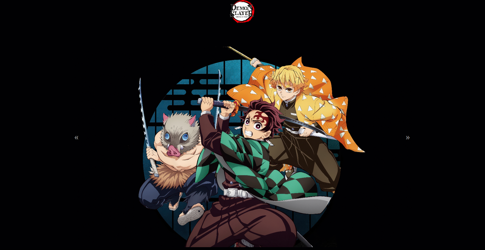

# 👺 Demon Slayer Slider ⚔️



---

Bem-vindo ao projeto **Demon Slayer Slider**, um slider de imagens simples e elegante, construído com HTML, CSS e JavaScript. Este projeto foi feito para os fãs de Demon Slayer que querem ver seus personagens favoritos em ação!

O slider apresenta uma navegação fácil e transições suaves, permitindo que você percorra as imagens dos personagens principais do anime.

---

## 🛠️ Tecnologias Utilizadas

* **HTML:** Para a estrutura da página.
* **CSS:** Para o estilo e as animações.
* **JavaScript:** Para a funcionalidade do slider e navegação das imagens.

---

## 🚀 Como Rodar Localmente

É super fácil! Siga estes passos simples para rodar o projeto na sua própria máquina.

1.  **Clone o repositório:**
    ```bash
    git clone [https://github.com/seu-usuario/nome-do-seu-repositorio.git](https://github.com/seu-usuario/nome-do-seu-repositorio.git)
    ```

2.  **Abra o arquivo:**
    Navegue até o diretório do projeto e simplesmente abra o arquivo `index.html` em qualquer navegador web de sua preferência (como Google Chrome, Firefox, etc.).

3.  **Explore!**
    Pronto! Agora você pode ver o slider em funcionamento e até mesmo explorar o código para entender como ele foi feito.

---

## 💡 Contribuição

Gostou do projeto? Sinta-se à vontade para fazer um "fork" e propor melhorias! Seja a adição de mais personagens, novas transições ou qualquer outra ideia legal, sua contribuição é bem-vinda.

---

## ✍️ Autor

Este projeto foi criado por **Gabriel Lacerda**.

* **LinkedIn:** [linkedin.com/in/gabriellacerda1005](https://www.linkedin.com/in/gabriellacerda1005)